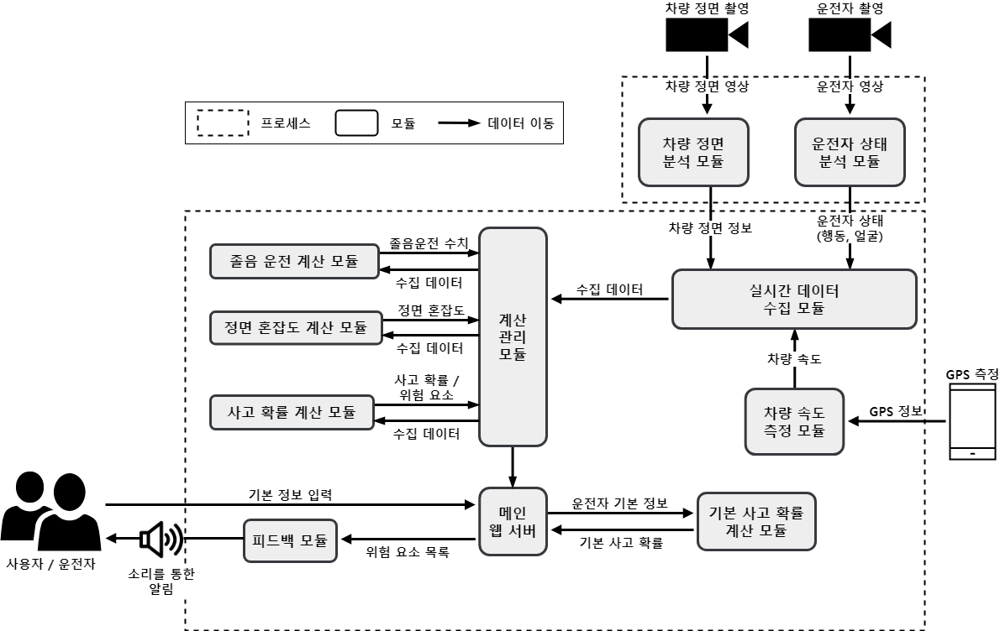
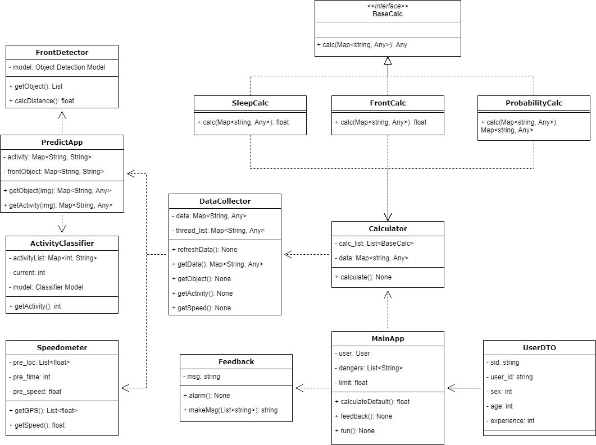
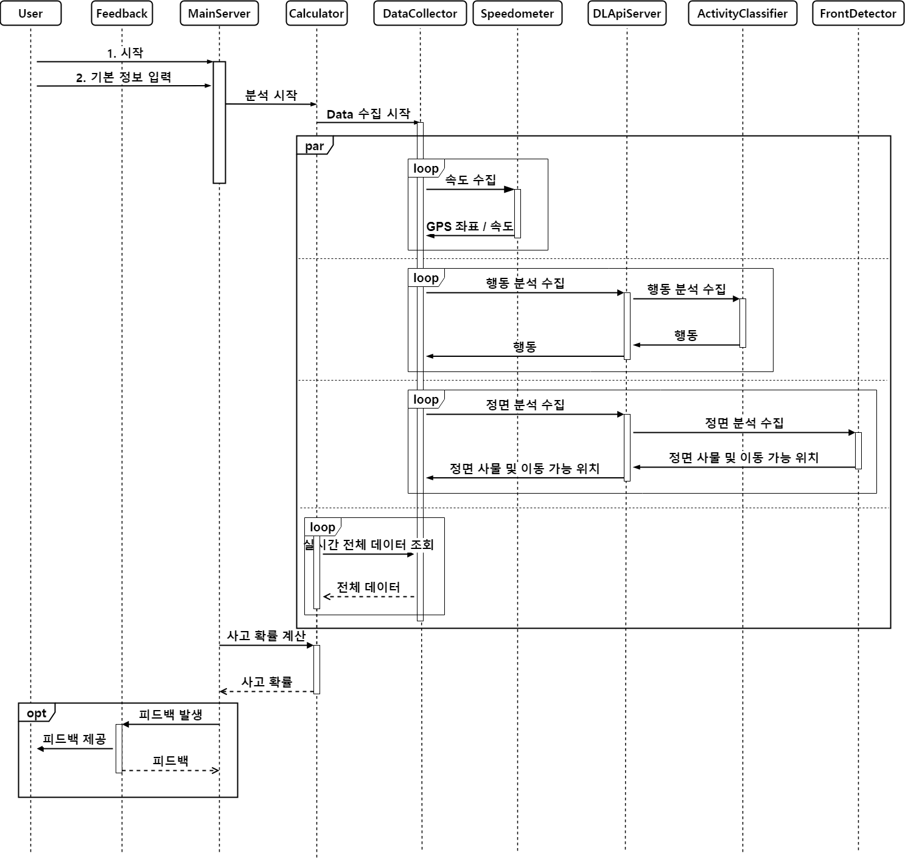

# Accident Probability Calculation

운전자, 정면 차량, 도로 정보 분석을 통한 교통사고 확률 모니터링 시스템

## 요약
현재 대중적으로 사용되고 있는 내비게이션의 경우, 도로 형태나 사고 통계와 같은 고정적인 요소에 대해서만 운전자에게 알림을 주고 있다.
이는 사고가 발생할 수 있는 실시간 요소에 대해서는 운전자에게 알려줄 수 없으며 주로 사고는 실시간 요소에 더 영향을 받는다고 예상된다.
따라서 본 연구에서는 운전자 행동, 차량 속도, 도로 상황, 차량 주변 상황을 실시간으로 확인하며 사고 확률을 추론하고 이를 운전자에게 알려주는 시스템을 제작한다.

## 구성원

|이름|소속|학번|         이메일         |
|:---:|:---:|:---:|:-------------------:|
|이상화|컴퓨터공학과|2017104009| xezout108@khu.ac.kr |

## 연구 배경
최근 나라의 발전 및 고령화 진행으로 인해 매해 우리나라 교통량이 증가하고 있다.
또한 차량 기술 발전으로 인해 교통사고 건수가 줄 수 있었지만 교통량 증가로 인해 매해 약 20만건 이상의 사고가 발생하고 있습니다.
최근 차량 내부 및 외부에 운전자의 편의를 위해 운전을 도와주는 시스템이 잘 구축되고 있으며 이 덕분에 과거와는 달리 운전이
쉬워졌으며 사고 위험도 줄었다고 생각한다. 하지만 운전자도 사람이기 때문에 사고 발생 가능 상황에 대해서 즉각적으로 반응할 수
없다고 생각하였다. 따라서, 본 연구에서는 운전자, 도로, 차량 주변 상황 등 정보를 통해 사고 발생 확률을 추론하여 실시간으로
운전자에게 알려 사고를 예방하는 시스템을 만들기 위해 연구를 진행하기로 하였다. 

## 프로젝트 소개



차량에서 실시간으로 촬영한 운전자의 측면과 정면 이미지를 통해 현재 운전자의 행동 및 차량 정면을 분석한다.
이 정보를 기반으로 운전자의 졸음 운전, 정면 혼잡도 등을 분석한 후 최종적으로 사고 확률을 계산한다.



전체 프로젝트는 추후 추가될 요소들을 고려하여 Adaptor 구조로 구현되어 있다.



## 프로젝트 구조
```
├─docs
│  ├─기초조사서
│  ├─면담확인서
│  ├─최종보고서
│  └─중간보고서
├─imgs
└─src
   ├─MainApp
   │  ├─dto
   │  ├─modules
   │  ├─realtime
   │  ├─router
   │  ├─static
   │  ├─templates
   │  ├─utils
   │  └─app.py
   │
   └─PredictApp
      ├─modules
      ├─router
      ├─utils
      └─app.py
```